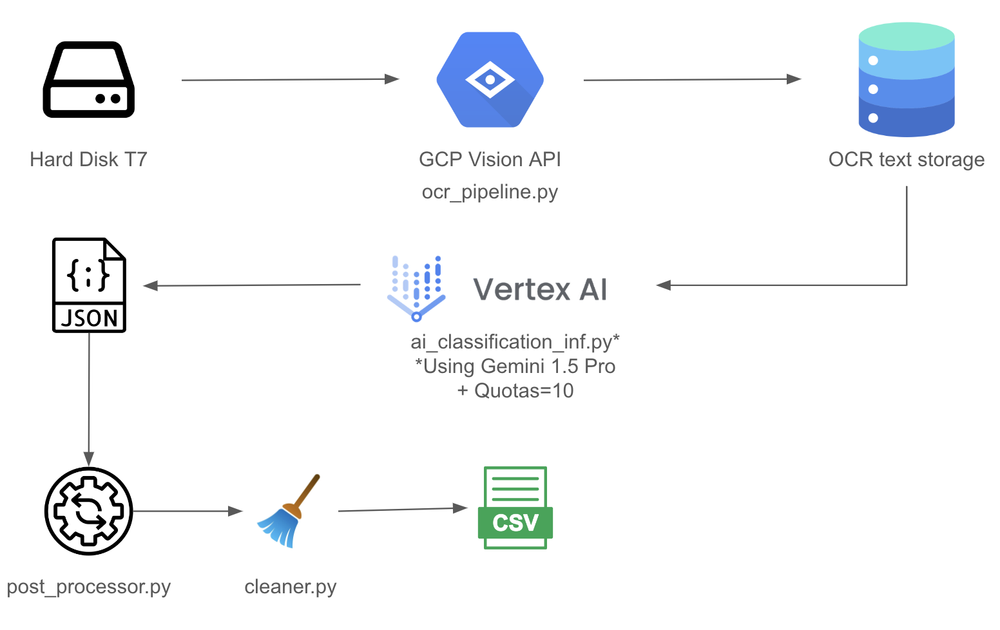

# Catalog Labeling AI App - *using OCR & Generative AI*

## Table of Contents

- [Project Overview](#project-overview)
- [Installation & How-to Guide](#installation--how-to-guide)
- [Further Improvements](#further-improvements)
- [TO-DO](#to-do)

## Project Overview

Hi there! This project introduces a tool I created to help automate the labeling of Vinyl LPs as part of my civil service in Switzerland (similar to military service). The tool is designed to streamline the cataloging process for the MEG Museum’s ethnomusicology department.

🎯 **Project Objective**

The primary goal of this application is to optimize the time required for labeling the collection at the MEG Museum. Initially, the labeling process was done manually, averaging 8 to 10 LPs per day, with each LP taking approximately 1.5 hours. This project aims to reduce the time to around 20 minutes per LP, making the process 5.5x faster! ⚡️ 

This calculation includes human-in-the-loop feedback for verification.

💿 **Version 1**

The first version of this application should be seen as a companion tool for cataloging LPs. Manual verification and editing are still required at this stage. In future versions, we could imagine incorporating API integrations (such as Discogs or Google Search) to further automate the process, moving toward a more autonomous solution.

While exploring different approaches, I considered using LLM (Large Language Model) vision models. These could be an interesting option due to their ability to process images directly. However, I found them to be too volatile in their accuracy. As a result, I decided to go with an OCR method followed by AI inference, which provided more consistent and reliable results.

The core functionality of the application resides in the `ocr_meg_collection` folder, and the project's architecture is outlined below:

### Application Architecture



```bash
ocr_meg_collection/    # Poetry-based orchestration environment
├── __init__.py
├── ai_classification_inf.py
├── ai_classification_inf_debug.py
├── cleaner.py
├── main.py
├── ocr_pipeline.py
├── post_processing.py
├── post_processing_debug.py
└── utils.py
```

### **Cost Breakdown**

Currently, I have $200 in GCP credits, which is great for experimentation. Here's a cost estimate for running the application:

| Service                           | Cost (USD)         | Description                                                                 |
|-----------------------------------|--------------------|-----------------------------------------------------------------------------|
| OCR (Google Cloud Vision API)     | $1.50/1000 units   | First 1000 units/month are free. Costs $1.50 for 1001-5M units.             |
| AI Inference (Gemini 1.5 Pro)     | $0.005 - $0.008    | Text input: $0.00125/1k characters; Text output: $0.00375/1k characters.    |
|                                   |                    |                                                                             |
| **Total Cost**                    | **Per LP**         | **For 1000 LPs**                                                            |
| With free-tier OCR                | **$0.0065**        | **$6.50**                                                                   |
| After free-tier OCR               | **$0.008**         | **$8.00**                                                                   |

### **Limitations & Considerations**

During the pre-production phase, I tested several methods for OCR and AI inference, including open-source libraries:

- **OCR:** Pytesseract, EasyOCR
- **AI Inference:** Ollama Instruct Model (Mistral Nemo, Llama 3.1)

I also experimented with GPT-4 Vision models. While LLM vision models could be an interesting approach due to their end-to-end capabilities, they proved too volatile in accuracy for this application. Therefore, I opted for a dedicated OCR method followed by AI inference, which provided more consistent results.

Another limitation is that when running the script locally, there's some latency due to API calls for AI inference. This latency is manageable but could be improved. Possible enhancements include using local software for OCR and AI inference with Ollama or Groq (leveraging GPUs). A more costly solution would be to containerize the app and run it via Cloud Run in GCP—this requires further investigation.

## Installation & How-to Guide

1. **Clone the repository:**

    ```bash
    git clone https://github.com/LucaZoss/OCR-AI-LPs-Classifier.git
    ```
   
2. **Install dependencies using Poetry:**

    ```bash
    poetry install
    ```

   Alternatively, if you prefer `requirements.txt`:

    ```bash
    pip install -r requirements.txt
    ```

3. **Set up environment variables:**

   Create a `.env` file in the root directory of the project with the following content:

    ```
    GOOGLE_APPLICATION_CREDENTIALS=path/to/your/google-cloud-credentials.json
    BASE_DIRECTORY=path/to/your/LPs/directory
    ```

   - `GOOGLE_APPLICATION_CREDENTIALS` should point to your Google Cloud service account JSON key file.
   - `BASE_DIRECTORY` is the root directory where the LP images are stored.

4. **Run the application:**

    ```bash
    poetry run python main.py --num-lps [NUMBER_OF_LPS]
    ```

   - Replace `[NUMBER_OF_LPS]` with the number of LPs you want to process.
   - **Note:** Due to API quota limitations, the application can currently process a maximum of **10 LPs per minute**.

   For example, to process 5 LPs:

    ```bash
    poetry run python main.py --num-lps 5
    ```

   If you do not specify the `--num-lps` argument, the application will default to processing all LPs in the directory, subject to the API quota limitations.

## Further Improvements

- **Fully Open-Source and Local Implementation:**

  Explore using open-source tools like OLLAMA to run both OCR and AI inference locally. This would eliminate dependency on external APIs, reduce latency, and potentially lower costs after considering hardware investments.

- **Agent-Based System with API Integrations:**

  Develop a more autonomous system where the LLM can access functions to call external APIs such as the Discogs API or Google Search API. This would enhance the application's ability to fetch accurate metadata and improve labeling accuracy.

## TO-DO

- [x] Publish the first version
- [ ] Create a comprehensive README file
- [ ] Dockerize the application
- [ ] Fine-tune AI output
- [ ] Explore integration with OLLAMA

---


