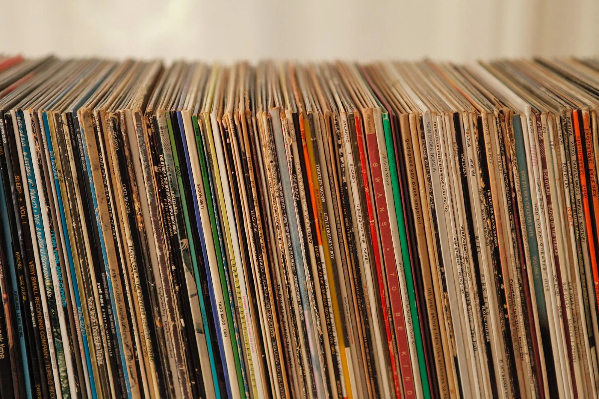
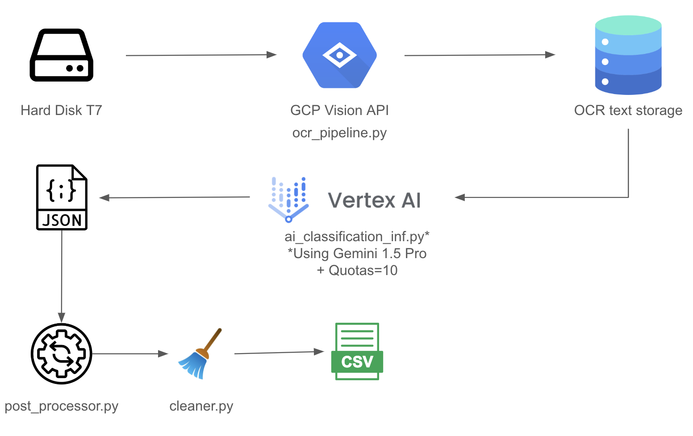
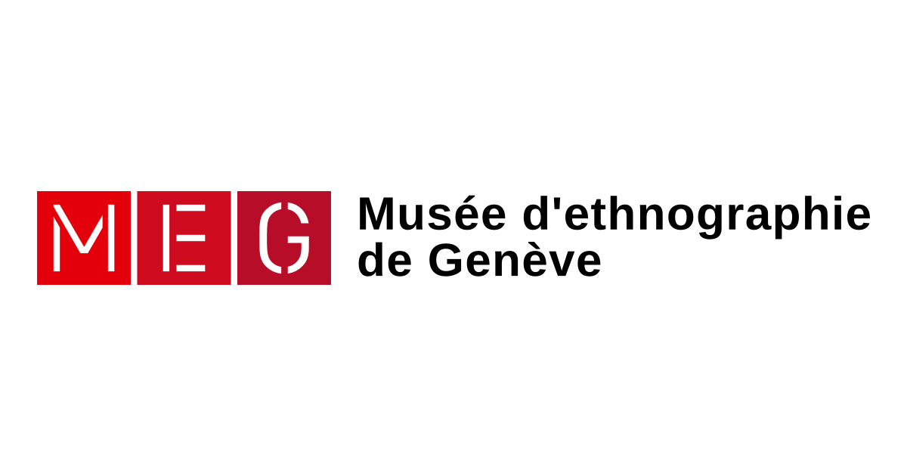

# Catalog Labelling AI App - *using OCR & Generative AI*
**INDEX**

- [Project Overview](#Project-Overview)
- [How-To-Guide](#How-to-Guide)
- [Further Improvements](#Further-Improvements)
- [TO-DO](#to-do)

## Project Overview

Hi there! This is a project overview of a tool created to help me do Vinyl LPs catalog labelling within my switzerland citizen labourship (kind of swiss military service.)

🎯 **Project Objective** 

The goal of this application was to optimize the time used for labelling the collection inside the MEG museum (ethno-musicologie department).

The initial situation was to do this work manually, making on average from 8 to 10 LPs per day (~1.5hour per LP). This project aims to reduce this work to 20minutes per object. (Making it 5.5x faster!⚡️) (This calculation is taking into account human feedbacks in the loop.)

💿 **Version 1**

The first version of this application should be approached as a companion for labelling the LPs, therefore a manual process of double checking and editing should be done manually. In future version, we could imagine to switch to a more agentic-based methodology plugin some API such as DISCOGS or event Google Search?

The core of the application hide in the ```ocr_meg_collection```folder, in which its architecture is settled as follows:

1.ocr_meg_collecton --> Poetry Orchestration Environement
```bash
.
├── __init__.py
├── ai_classification_inf.py
├── ai_classification_inf_debug.py
├── cleaner.py
├── main.py
├── ocr_pipeline.py
├── post_processing.py
├── post_processing_debug.py
└── utils.py
```



**TO-DO**

- [x] Publish first version
- [ ] Create README File
- [ ] Dockerize
- [ ] Fine-Tune Output
- [ ] Ollama?
#



[def]: ocr-meg-collection/architecture.png